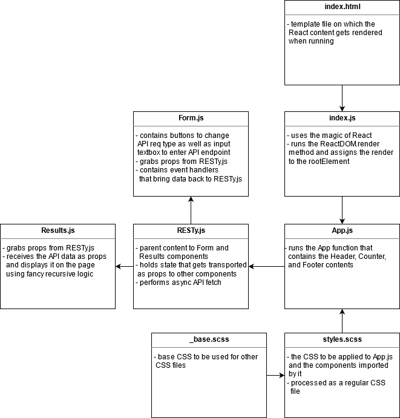

# Lab 23 — Props and State

## React Web App Mimicking Postman

Lab 23 and then some for CF JS 401 Nights

### Author: Earl Jay Caoile

### Links and Resources

#### Submission Reqs

- [submission PR](https://github.com/earljay-caoile-401-advanced-javascript/react-resty/pull/1)
- [GitHub actions](https://github.com/earljay-caoile-401-advanced-javascript/react-resty/actions)
- [code sandbox](https://codesandbox.io/s/resty-vilrl)
- [Netlify deployment](https://youthful-liskov-6b361a.netlify.app/) 

#### Resources

- [HTML Color Picker](https://www.w3schools.com/colors/colors_picker.asp)
- [HTML input tag](https://www.w3schools.com/tags/tag_input.asp)
- [how to make header and footer stay at top and bottom of page](https://stackoverflow.com/questions/643879/css-to-make-html-page-footer-stay-at-bottom-of-the-page-with-a-minimum-height-b)
- [vertical centering with flexbox](https://philipwalton.github.io/solved-by-flexbox/demos/vertical-centering/)
- [CSS borders](https://www.w3schools.com/css/css_border.asp)
- [how to disable text selection highlighting](https://stackoverflow.com/questions/826782/how-to-disable-text-selection-highlighting)
- [how to enable document.body in testing](https://stackoverflow.com/questions/43694975/jest-enzyme-using-mount-document-getelementbyid-returns-null-on-componen)

### Documentation

- [React JS Hello World](https://reactjs.org/docs/hello-world.html)
- [SASS](https://sass-lang.com/)
- [Enzyme (Set State)](https://enzymejs.github.io/enzyme/docs/api/ReactWrapper/setState.html)

### Setup

- install node packages locally with `npm i` from the root directory in Terminal
- start the server with `npm start`

### Using the App

The display logic is designed to be able to work with any API. However, I have only verified that this app has worked with the following APIs:

- my own lab API: https://cf-js-401-api-server.herokuapp.com/api-docs (i.e.: https://cf-js-401-api-server.herokuapp.com/api/v1/categories)
- PokeAPI: https://pokeapi.co/ (i.e.: https://pokeapi.co/api/v2/pokemon/ditto)

To make a GET API call, type or paste the API endpoint and hit `enter` or click the submit button to submit

### UML

